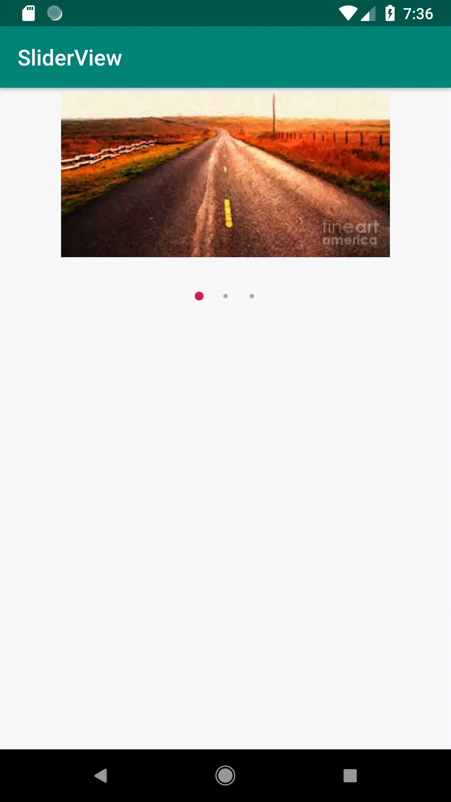

# SliderViewLibrary
[]( https://android-arsenal.com/details/1/7621 ) <br>
An easy to use Android Library to get slides in apps using images or image URLs
## Medium Article to implement SliderView from scratch. [Link](https://medium.com/@nikhilsachdeva57/implementing-slide-shows-in-android-apps-e1acca53953a)
### Also [here](https://mostly-dumb.github.io/sliderview-android/)

## Gradle
Step 1. Add this in your root build.gradle at the end of repositories:


```
	allprojects {
		repositories {
			...
			maven { url 'https://jitpack.io' }
		}
	}
```

Step 2. Add the dependency

```
	dependencies {
	        implementation 'com.github.nikhil-sachdeva:SliderViewLibrary:1.0'
	}
```

Add SliderView to your activity_main.xml.

~~~ xml
<com.example.sliderviewlibrary.SliderView
    android:id="@+id/sliderView"
    android:layout_centerHorizontal="true"
    android:layout_width="300dp"
    android:layout_height="200dp"/>
~~~

Adjust layout height and width based on the size of images to be used.

Either use list of images as resources.

~~~ java
ArrayList<Integer> images = new ArrayList<>();
images.add(R.drawable.pic1);
images.add(R.drawable.pic2);
images.add(R.drawable.pic3);
sliderView.setImages(images);
~~~

Or use list of URLs.
(Add  < uses-permission android:name="android.permission.INTERNET"/ > in AndroidManifest.xml to access internet.)

~~~ java
ArrayList<String> Urls = new ArrayList<>();
Urls.add("url1");
Urls.add("url2");
Urls.add("url3");
sliderView.setUrls(Urls);
~~~

To implement time-based auto swiping, define DELAY_MS and PERIOD_MS as int variables to define delay and time period for swipes respectively.
And then execute a TimerTask on main UI thread as follows.

~~~ java
TimerTask task = sliderView.getTimerTask();
Timer timer = new Timer();
timer.schedule(task,DELAY_MS,PERIOD_MS);
~~~
## And Voila!



```
Copyright 2019 Nikhil Sachdeva

Licensed under the Apache License, Version 2.0 (the "License");
you may not use this file except in compliance with the License.
You may obtain a copy of the License at

    http://www.apache.org/licenses/LICENSE-2.0

Unless required by applicable law or agreed to in writing, software
distributed under the License is distributed on an "AS IS" BASIS,
WITHOUT WARRANTIES OR CONDITIONS OF ANY KIND, either express or implied.
See the License for the specific language governing permissions and
limitations under the License.
```


